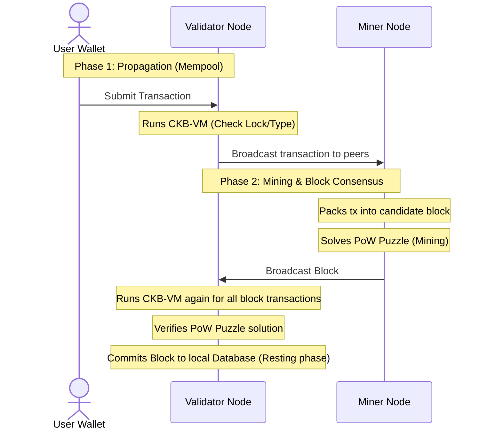

# CKB Architecture & Verification Investigation Record

This document compiles the core concepts covered in our discussion regarding CKB-VM, smart contract execution, cryptographic security, and the decentralized consensus verification model.

---

## 1. CKB Smart Contracts & The Entry Point

### Why Avoid standard `fn main()`?
In a standard Rust application, `fn main()` comes with a hidden setup runtime (initializes the stack, parses arguments, sets up panic handlers).
* On CKB, we use `#![no_main]` to strip this overhead away.
* We define a custom entry point (e.g., `program_entry() -> i8`) to minimize binary size and control stack allocation directly.

### What is a Syscall?
Since CKB-VM is an isolated sandbox, a smart contract cannot directly read the blockchain state (like cell data or transaction inputs/outputs).
* A **syscall** is a software interrupt instruction (RISC-V `ecall`).
* It pauses execution of the contract and asks the host CKB node to retrieve data.
* Once the node fetches the requested data, it writes it to the contract's memory space and resumes execution.
* *Analogy:* Like a legacy BIOS interrupt (`INT 0x10`) or a secure bootloader service API.

---

## 2. CKB-VM & Transaction Verification

### What is CKB-VM?
* A pure software emulator that simulates a **RISC-V CPU**.
* It runs on your local machine (via `offckb` node) and on every validator node in the public networks (Testnet and Mainnet).

### The Basic Verification Rule
The CKB-VM executes lock and type scripts. The network accepts a transaction if and only if **all scripts return an exit code of `0` (Success)**.
```
                      [ Transaction Submitted ]
                                 │
                   ┌─────────────┴─────────────┐
                   ▼                           ▼
        [ Lock Script Runs ]        [ Type Script Runs ]
           (e.g. SECP256K1)            (e.g. sUDT rules)
          Verifies ownership.         Verifies conservation.
                   │                           │
                   └─────────────┬─────────────┘
                                 ▼
                     Are both exit codes 0?
                       ├── YES ──→ Accept Transaction
                       └── NO  ──→ Reject Transaction
```

---

## 3. Cryptographic Hashing vs. Encryption

In CKB, you encounter many "hashes" (e.g., `code_hash`, script `args`). These are **fingerprints**, not encrypted blocks.

| Metric | Hashing | Encryption |
| :--- | :--- | :--- |
| **Reversible?** | **No** (One-way road) | **Yes** (With the correct key) |
| **Purpose** | Verification, integrity, compact referencing. | Confidentiality (hiding data to read later). |
| **Output Size** | **Fixed-size** (Always 32 bytes in CKB). | Variable (scales with input size). |

### Practical Uses in CKB:
1. **`code_hash` (Referencing)**: Instead of including a 50 KB smart contract binary in every transaction, the binary is stored on-chain once. Transactions reference it using its unique 32-byte `code_hash` fingerprint.
2. **`args` (Privacy)**: An address is `hash(public_key)`. This keeps your real public key hidden until you spend the funds.

---

## 4. Decentralized Consensus: Full Nodes vs. Miner Nodes

The validation pipeline relies on two types of nodes to ensure security without central authority:

### Full Node (Validator) vs. Miner Node

* **Full Node**: Acts as a **Judge**. It keeps a full copy of the blockchain ledger and verifies all blocks/transactions, but does not participate in mining.
* **Miner Node**: Acts as a **Worker**. It is a full node attached to ASIC mining hardware. It solves the Proof of Work (PoW) puzzle to propose new blocks.

### The Two-Phase Verification Flow



1. **Phase 1: Propagation (Mempool Verification)**:
   * When a transaction is first created, it propagates through all nodes.
   * Every node (Validator and Miner) executes the scripts in CKB-VM to filter out spam.

2. **Phase 2: Block Consensus (Audit & Write)**:
   * **Mining**: Miner nodes solve the PoW puzzle to lock in a block of transactions.
   * **Double-Check**: When the block is broadcast, **all nodes** run CKB-VM again on every transaction in that block to guarantee the miner didn't cheat or validate invalid state transitions.
   * **Finalization**: Once a block is accepted and committed, the transactions inside are written to the database. They never need to be executed again for consensus.
